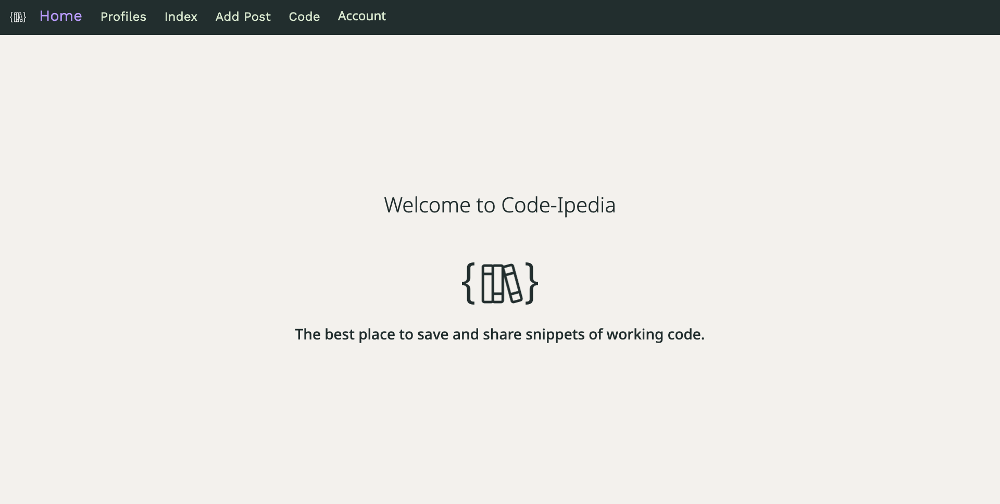

# Code-Ipedia Front End
# 

The following MERN stack CRUD application is called Code-Ipedia! Code-Ipedia is an application for saving and sharing functional code. Upon loading, users will be taken to a landing page where they have the option to log in or sign up if they have not created an account and will then have the ability to add a post, view all of the posts that have been shared to the site, filter through all the posts by using the categories of said code, view all the profiles that have been created, and view all of the code that each user has posted on their own profile page. On the index page of the site, users will be able to click on each post that has been made and be taken to a show view of that code where they can leave comments about the code to the owner, and if they own the code, they have the option to either edit the code or delete it.

## Getting Started:
The following is the link to the [app](https://code-ipedia.netlify.app/), the link to the [Trello](https://trello.com/b/tTBaOcHd/code-ipedia), and the link to the [back-end](https://github.com/jsantia85/code-ipedia-back-end).

## Technologies Used:
- 
- 
- 
- 
- 
- 
- 
- 
- 
- 
- 
- 
- 
- 
- 
- 
- 

## Contributors:
- [Kailana: Scrum Manager](https://github.com/kailanajt)
- [Minji: Database Manager](https://github.com/minjijeong2000)
- [Nick: CSO (Cheif Style Officer) and Code Editor Researcher](https://github.com/LargeWater)
- [Juan: Git Commander and Documenter](https://github.com/jsantia85)

## Next Steps: 
